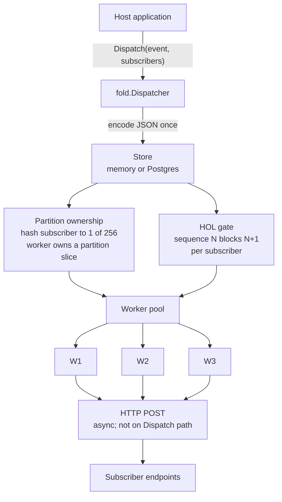
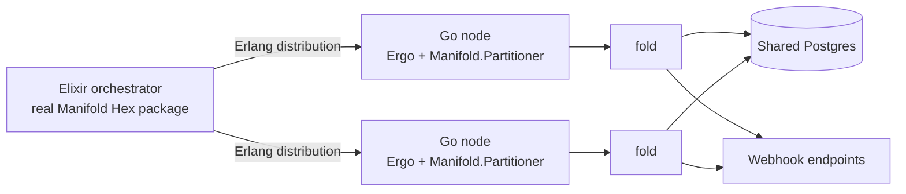

# fold

Go library for ordered webhook delivery under fan-out.

Inspired by Discord's [Manifold](https://github.com/discord/manifold) stable-assignment model: subscribers hash onto fixed partitions, and each worker owns a partition slice so one subscriber stays ordered while others run concurrently.

Stable ownership alone is not enough for third-party webhooks. Endpoints can stay unavailable across retry windows, so sequence N+1 can become due while N is in backoff. Without a gate, the same owner skips ahead. `fold` adds per-subscriber head-of-line (HOL) enforcement, retries with backoff, and suspend/resume so ordering holds under that failure model.

In the recorded local comparison: fold keeps **zero inversions** at about **22–40%** below unordered throughput, and about **8.3–14.9×** faster than strict FIFO (both ordered). Optional scale-out under `manifold/` runs the **real, unmodified Manifold Hex package** routing into Go workers over Erlang distribution (Ergo).

## Why fold

```
event 1 → subscriber A
event 2 → subscriber A
```

With a shared worker pool, a retry or a second worker can deliver event 2 first. Strict FIFO preserves order by serializing delivery across subscribers, including unrelated ones.

`fold` keeps A ordered without freezing B and C: A always maps to the same partition and owner; B and C map elsewhere and proceed in parallel. Under retry backoff, the HOL gate blocks N+1 until N is no longer pending or in flight.

## Architecture



Dispatch path (returns when rows are durable in the store):

1. Host calls `Dispatch` with an event and subscribers.
2. Payload is JSON-encoded once; bytes are shared read-only across that event's deliveries.
3. Each subscriber is hashed to a partition in `[0, 256)`; one delivery row is enqueued per subscriber.
4. `Dispatch` returns — no HTTP on this path.

Delivery path (workers):

5. Workers claim due, HOL-eligible rows only in partitions they own, POST asynchronously, then mark success / schedule retry / suspend.

## Why fixed partitions

Assignment is:

```
hash(subscriberID) → partition ∈ [0, 256) → owning worker
```

not:

```
hash(subscriberID) % workerCount
```

Hashing onto worker count remaps nearly every subscriber when the pool grows or shrinks — exactly when you need ownership to stay stable. Fixed partitions move under workers; subscribers stay on their partition.

## Ordering and failure semantics

1. **Exclusive ownership.** One subscriber → one partition → one owner. Peers cannot claim that subscriber's deliveries.
2. **Ownership is not enough under retry.** If sequence N fails and enters backoff, N+1 can become due. The same owner would skip ahead without a gate.
3. **HOL gate.** A delivery is claimable only when no earlier-sequence row for that subscriber is still pending or in flight. Tests assert zero inversions with the gate on and nonzero with it off (peer race via overlapped ownership; same-owner skip-ahead via failure injection).
4. **Suspend.** After retries are exhausted (or a permanent failure), the subscriber is suspended: nothing further is delivered, remaining backlog is retained up to configured bounds — not shuffled onward.
5. **Resume.** Host-driven, pull-based. Resume clears suspension and replays retained rows in sequence order. If retention overflowed, resume reports a gap and a marker. Fold does not invent the host's event-history API.

Resize bumps a generation stamp so drained workers cannot complete under a stale ownership map. On `Start`, claims older than `StaleClaimAge` (default `2 × DeliveryTimeout`) are reset to pending.

## Benchmarks

Local mechanism comparison (not a production bake-off against Kafka, Svix, etc.): 64 subscribers, 40 events (2560 deliveries), 16 workers, transient failure every 17th attempt. Baselines: `naive` (shared queue, unordered) and `fifo` (single-threaded, ordered).

Headline — uniform 1ms latency (2026-09-09):

| | deliveries/s | inversions |
|---|---:|---:|
| **fold** | 9,623 | **0** |
| naive | 12,414 | 1,193 |
| FIFO | 645 | 0 |

Across the latency sweep (uniform through 100ms spread):

- fold: **zero inversions**; naive: ~**1,150–1,190**
- fold: about **22–40% slower** than naive
- fold: about **8.3–14.9× faster** than FIFO; both preserve order

HOL attribution (uniform-1ms, same ownership): disabling HOL raised throughput from **74% → 91%** of naive but introduced **85** inversions (rows/claim 3.7 → 34.3). Nine points of gap remain unexplained.

Full tables and environment: [`results/benchmarks/latency-sweep-2026-09-09.txt`](results/benchmarks/latency-sweep-2026-09-09.txt).

```bash
go test ./bench/ -run 'TestLatencyVarianceSweep|TestUniformOverheadAttribution' -v
```

## Manifold integration

Optional scale-out under [`manifold/`](manifold/). Inspired by Manifold's stable assignment; not affiliated with Discord.



- Go nodes join the cluster via Ergo (`erlang23`) and register as `Elixir.Manifold.Partitioner`.
- Real, unmodified Manifold routes by `node(pid)`.
- **Manifold decides where** (which Go node owns which subscriber).
- **fold decides when** (HOL, retries, suspend/resume) on shared Postgres with disjoint `PartitionsClaim`.
- No Manifold or Ergo fork. Dispatch payloads use a JSON binary; nested ETF maps did not round-trip reliably into Ergo.

```bash
./manifold/run.sh   # epmd, Elixir, Postgres; see manifold/
```

## Quick start

Requires Go 1.26+ (module declares `go 1.26.1`).

```bash
go get github.com/sharathb5/sharathfold@latest
```

```go
package main

import (
	"context"
	"encoding/json"
	"log"
	"time"

	"github.com/sharathb5/sharathfold"
)

func main() {
	ctx := context.Background()
	d, err := fold.New(fold.Config{
		Workers:    4,
		Partitions: 256, // default if omitted
	})
	if err != nil {
		log.Fatal(err)
	}
	if err := d.Start(ctx); err != nil {
		log.Fatal(err)
	}
	defer func() {
		cctx, cancel := context.WithTimeout(context.Background(), 30*time.Second)
		defer cancel()
		_ = d.Close(cctx)
	}()

	payload, _ := json.Marshal(map[string]string{"order_id": "ord_1"})
	err = d.Dispatch(ctx, fold.Event{
		ID:      "evt_1",
		Type:    "order.created",
		Payload: payload,
	}, []fold.Subscriber{{
		ID:  "sub_acme",
		URL: "https://example.com/hooks/acme",
		// Secret: []byte("whsec_..."), // optional Fold-Signature HMAC
	}})
	if err != nil {
		log.Fatal(err)
	}
}
```

Default store is in-memory; pass `store/postgres` for durability. Default transport is HTTP with optional `Fold-Signature` when `Subscriber.Secret` is set.

```bash
go test ./...
go test ./bench/ -run TestCompareFoldVsNaive -v
```

Postgres-backed tests need a reachable DB (`FOLD_PG_TEST_DSN`, or local `fold_test`). Set `FOLD_PG_ALLOW_SKIP=1` to skip when unavailable (CI requires the DSN).

## Repository layout

```
.
├── README.md
├── LICENSE
├── *.go                 # package fold (Dispatcher, workers, HTTP transport)
├── examples/basic/      # minimal Dispatch example
├── internal/            # hash, backoff
├── store/               # Store interface; memory/ and postgres/
├── bench/               # fold vs naive vs fifo harnesses
├── results/benchmarks/  # recorded bench transcripts
├── manifold/            # optional Elixir + Ergo scale-out
├── spike/               # Ergo/Manifold handshake experiments
├── scripts/             # invariant checks
└── .github/workflows/   # CI
```

Unit tests live next to the packages they cover (Go convention). Postgres / multi-node / HOL tests stay in the root package so they can exercise unexported state.

## Design tradeoffs

- Default is single-process. Multi-node uses static partition slices today; live rebalance across Go nodes is unfinished.
- Ordering and benches assume a cooperative local setup (in-process or one Postgres). Multi-region and network partitions are out of scope.
- Suspend/resume is safe by construction when suspension runs after `Deliver` under one lock; host-initiated suspend mid-flight is not covered by that proof.
- Benchmarks compare mechanisms in-process against sketch baselines, not tuned production fleets.

## Development

```bash
go test ./... -short
./scripts/check-invariants.sh    # store import graph + no marshal in worker path + manifold/go build
golangci-lint run ./...          # if installed; also in CI
go test ./bench/ -run 'TestLatencyVarianceSweep|TestUniformOverheadAttribution' -v
```

CI runs the same invariants, `go vet`, tests with `-short` (with Postgres service), and `manifold/go` vet/build.

## License

Apache-2.0. See [LICENSE](LICENSE).
